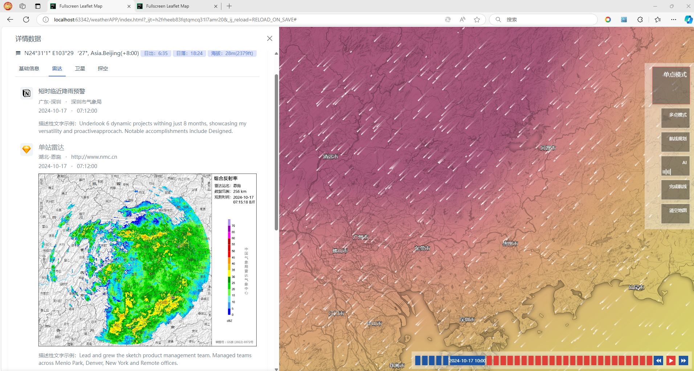
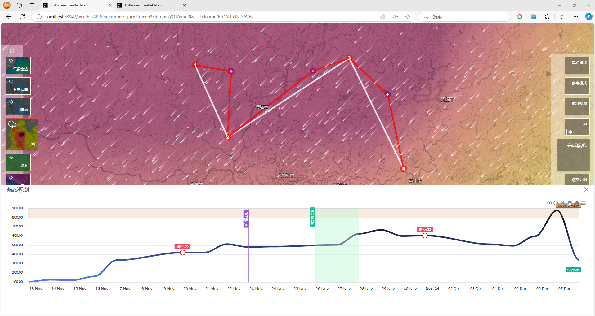

# APP原型

启动前端：
http-server .

## 2024-10-28 更新
- 不同缩放级别显示不同瓦片
- 增加全国主要城市文字

## 2024-10-17 更新
- 引入前端模板框架
- 单点模式原型
- 航线规划原型
- AI问答原型
- 优化地图显示

## 2024-10-11 更新
- 新增左侧菜单，点击事件需重写 js/map.js changeMaps()
- 新增底部弹窗，点击事件需重写 js/bottomPopupDiv.js
- 调整部分css、js
- 新增config.js

单点模式：点击地图显示点，点击点查详情
多点模式：点击地图添加多个点，点击按钮查看详情
航线规划：点击地图店家多个点，点击按钮查看详情
AI：点击弹出对话框

## 参考资料
- 风场粒子基于 leaflet-velocity.js 参考：https://github.com/onaci/leaflet-velocity
- 强度图基于 leaflet-vector-scalar.js 参考 https://xiaozhuanlan.com/topic/2641378905 在此js中我删除了绝大多数与强度图无关的代码（可能没删干净），目前看起来比较方便
- 关于数据格式的详细说明，可以参考：https://github.com/Esri/wind-js